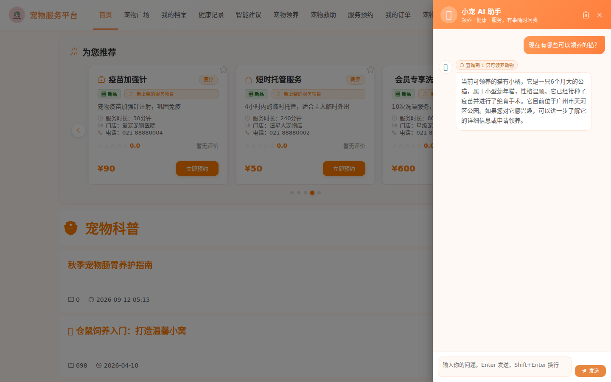
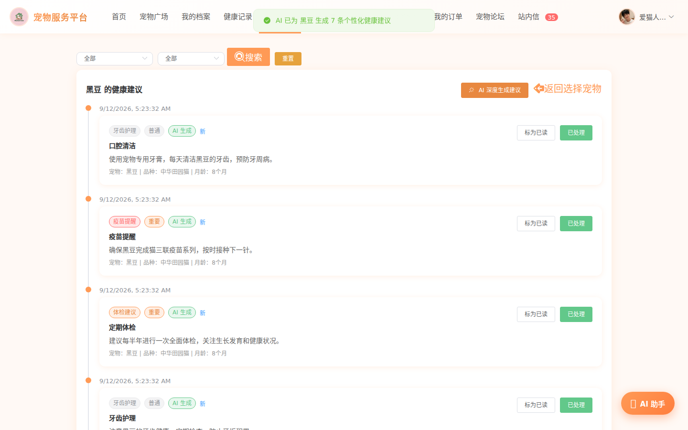
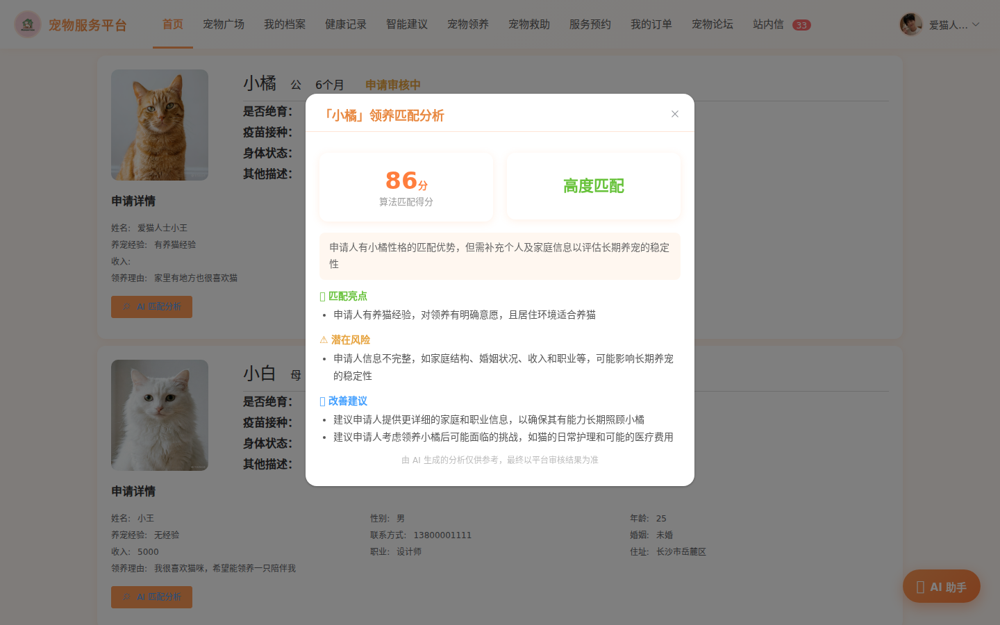
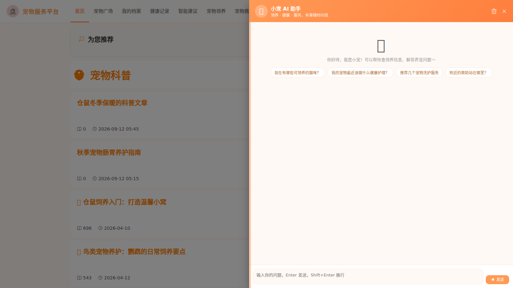

# 宠物救助管理系统（pet-system）

     

基于 **Spring Boot + Vue + MySQL + Redis** 实现的宠物数字化管理与社区互助服务平台，涵盖流浪动物领养、救助站管理、宠物健康档案、服务预约、社区科普等模块。

平台内置基于大模型 **Function Calling** 的轻量级 AI Agent 智能助手，并集成 AI 健康建议、领养匹配 AI 分析与宠物照片多模态识别建档能力。

## ✨ 功能特性

### 业务模块

- **宠物领养**：可领养动物浏览、多维度筛选（品类/体型/聚类标签）、领养申请与审核流
- **流浪动物救助**：救助站与喂食点管理、绝育（TNR）记录、公益活动
- **宠物健康档案**：宠物档案、健康记录（疫苗/驱虫/体检/治疗）、健康仪表盘、站内信提醒
- **服务预约**：洗护/美容/寄养/医疗服务的预约下单、订单生命周期管理、评价体系
- **社区内容**：宠物论坛、知识科普、评论互动
- **后台管理**：用户/角色/菜单权限、数据看板（ECharts）

### 🤖 AI Agent 智能助手

| 能力 | 说明 |
|---|---|
| 多轮工具调用 | 21 个业务工具（查询/写操作/统计），LLM 自主决策"感知→调用→观察→再决策"循环 |
| 业务写操作 | 领养申请提交、健康记录录入、服务预约下单/取消，全部采用**两阶段人机协同确认**（预检→确认→落库） |
| 数据权限隔离 | 查询按登录用户过滤，仅能访问本人数据；统计/发布类工具带管理员权限门禁 |
| 算法融合推荐 | 调用平台自有领养匹配加权算法，为用户推荐匹配度最高的可领养宠物 |
| 主动式服务 | 定时扫描到期疫苗/驱虫/体检，由大模型生成个性化健康提醒推送站内信（失败自动降级模板） |
| 实体状态记忆 | 支持按名字解析实体、跨轮次回溯对话参数，禁止编造 ID |

### 其他 AI 能力

- **AI 健康建议**：基于宠物档案与健康记录由大模型生成个性化建议（规则引擎自动降级兜底）
- **领养匹配 AI 分析**：规则算法打分 + LLM 分析申请理由与动物性格的匹配亮点/风险/建议
- **宠物照片识别建档**：GLM-4V 视觉模型识别品种/毛色，自动填充建档信息（超大图自动压缩）

## 🏗 技术架构

```
┌─────────────────────────────────────────────┐
│  前端 frontend（Vue2 + Element UI + ECharts） │
│  门户 / 管理后台 / AI 悬浮聊天窗（可拖拽调宽）  │
└──────────────────┬──────────────────────────┘
                   │ axios (JWT)
┌──────────────────▼──────────────────────────┐
│  后端 backend（Spring Boot 2.5 + MyBatis-Plus）│
│  业务模块 │ JWT 认证/角色权限 │ Redis 防重/锁   │
│  ┌─────────────────────────────────────┐    │
│  │ AI Agent：GlmClient ↔ 工具注册中心(21) │    │
│  │  HealthAdviceAiService / AdoptAnalysis │   │
│  └──────────────┬──────────────────────┘    │
└─────────────────┼───────────────────────────┘
                  │
        MySQL 8.0（pet 库） + 智谱 GLM 开放平台
```

## 🚀 快速启动

### 环境要求

| 依赖 | 版本 |
|---|---|
| JDK | 8 |
| Maven | 3.6+ |
| Node.js | 14（17+ 需设 `NODE_OPTIONS=--openssl-legacy-provider`） |
| MySQL | 8.0 |
| Redis | 5+ |
| 智谱 API Key | [bigmodel.cn](https://bigmodel.cn) 注册获取（glm-4-flash 免费） |

### 步骤

```bash
# 1. 建库并导入表结构
mysql -u root -p -e "CREATE DATABASE pet DEFAULT CHARACTER SET utf8mb4"
mysql -u root -p pet < database/pet.sql

# 2. 配置大模型 API Key（二选一）
#    方式 A：新建 backend/application-local.yml（不入库）
ai:
  zhipu:
    api-key: 你的智谱APIKey
#    方式 B：直接编辑 backend/src/main/resources/application.yml 中的 api-key

# 3. 启动后端（端口 9311）
cd backend && mvn spring-boot:run

# 4. 启动前端（端口 9312，另开终端）
cd frontend && npm install && npm run serve
```

访问 http://localhost:9312 ，测试账号：`admin / 123456`（管理员）、`user1 / 123456`（普通用户）。

> Linux 一键启动脚本：`bash start.sh`（依赖路径按本机部署方式写死，标准环境请自行调整）

## 📁 目录结构

```
pet-system
├── backend                 # Spring Boot 后端
│   ├── src/main/java/com/ly/pet
│   │   ├── controller      # 接口层（含 AiChatController）
│   │   ├── service         # 业务层（含 AgentChatService/AgentToolRegistry/GlmClient）
│   │   ├── entity/mapper   # MyBatis-Plus 实体与映射
│   │   ├── task            # 定时任务（含主动健康提醒 Agent）
│   │   └── config          # 配置（JWT/CORS/AI 等）
│   ├── files/              # 运行期上传文件（不入库）
│   └── application-local.yml # 本地敏感配置（不入库）
├── frontend                # Vue2 前端
│   └── src/components/front/AiAssistant.vue  # AI 助手聊天窗
├── database                # 建库脚本
├── docs/images             # 演示截图
└── start.sh                # Linux 一键启动脚本
```

## 📸 演示

| AI 助手（工具调用轨迹） | 健康建议 AI 生成 |
|---|---|
|  |  |
| **领养匹配 AI 分析** | **聊天窗拖拽调宽** |
|  |  |

## ❓ 常见问题

- **克隆后图片不显示？** 运行期上传的图片（`backend/files/`）体积过大未入库，需单独获取并解压至该目录。
- **AI 功能提示未配置？** 按快速启动第 2 步填入智谱 API Key 后重启后端；未配置时健康建议自动降级为规则引擎，其余 AI 功能友好提示。
- **从 Windows 访问虚拟机里的服务？** 开发服务器已监听 `0.0.0.0` 且 API 地址动态跟随访问主机名，使用虚拟机 IP 访问即可（注意放行 9311/9312 端口）。

## License

[MIT](LICENSE)
